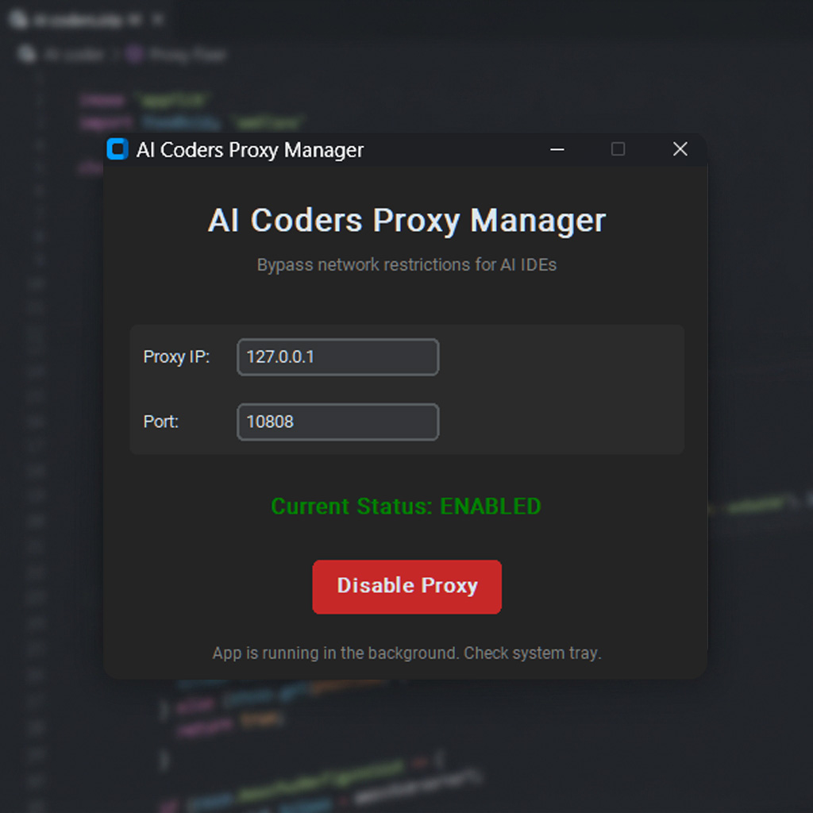
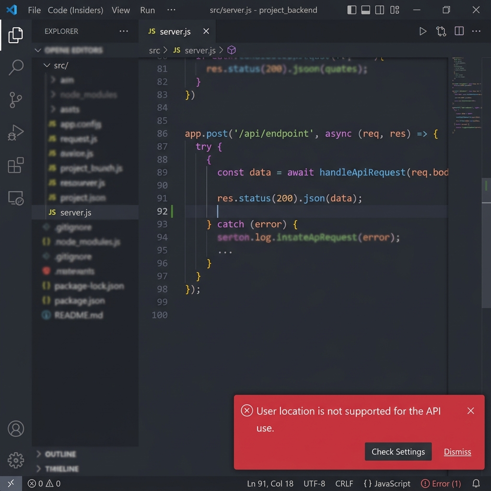

# 🚀 مدیریت پروکسی برای دستیارهای برنامه‌نویسی (AI Coders Proxy Fixer)

   

  <b><a href="README.md">🇺🇸 Read in English</a></b>

> یک ابزار متن‌باز، سبک و کاملاً پرتابل برای دور زدن محدودیت‌های جغرافیایی، فایروال‌های شرکتی و رفع خطاهای اتصال در دستیارهای هوش مصنوعی مانند Claude Code، Antigravity IDE، Cursor، OpenAI Codex و VS Code.

⭐️ **اگر این ابزار مشکل شما را حل کرد، لطفاً به این ریپازیتوری استار (STAR ⭐) بدهید تا سایر توسعه‌دهندگان نیز بتوانند آن را پیدا کنند!** ⭐️

  

## 🌍 شرح مشکل

توسعه‌دهندگانی که در مناطق تحت تحریم زندگی می‌کنند یا پشت فایروال‌های سخت‌گیرانه شرکتی قرار دارند، به طور مداوم با خطاهای شبکه‌ای در دستیارهای هوش مصنوعی مواجه می‌شوند. استفاده از برنامه‌های تغییر آی‌پی استاندارد (مانند v2ray یا Shadowsocks) معمولاً باعث بروز اختلال در مسیریابی سرورهای لوکال (Language Servers) می‌شود و کرش‌های پی‌درپی ایجاد می‌کند.

این ابزار خطاهای زیر را برای همیشه برطرف می‌کند:
- ❌ **خطای تحریم گوگل:** `User location is not supported for the API use.`
- ❌ **خطای کلود کد:** `Post "https://cloudcode-pa.googleapis.com/...": EOF`
- ❌ **کرش ترمینال:** `Failed to check terminal shell support` (در Antigravity و VS Code)
- ❌ **تایم‌اوت شبکه:** `connection refused` یا `ETIMEDOUT` در ادیتورهای Cursor
- ❌ **توقف ایجنت:** از کار افتادن ایجنت‌های خودکار در حین تولید کد

  

## 🎯 راه‌حل

برنامه **AI Coders Proxy Fixer** یک رابط کاربری گرافیکی (GUI) است که با یک کلیک، پیچیده‌ترین تنظیمات مسیریابی پروکسی را انجام می‌دهد. این ابزار به صورت هوشمندانه تنظیمات لازم را به IDE شما تزریق می‌کند و همزمان با اعمال استثنائات دقیق (مانند دور زدن `localhost` و `127.0.0.1`)، جلوی کرش کردن سرورهای لوکال را می‌گیرد.

### ✨ ویژگی‌های کلیدی
- **فعال‌سازی با یک کلیک:** روشن و خاموش کردن پروکسی برای کل محیط برنامه‌نویسی.
- **تزریق مستقیم به IDE:** اعمال تنظیمات بهینه‌شده در فایل `settings.json` ادیتورهای **VS Code, Antigravity IDE, Cursor و Void**.
- **مدیریت متغیرهای محیطی:** تنظیم خودکار و یکپارچه در قلب ویندوز (`HTTP_PROXY`, `HTTPS_PROXY` و غیره).
- **رفع مشکل Git:** تنظیم پروکسی گیت برای جلوگیری از فریز شدن دستورات `git push` و `git pull`.
- **دسترسی سریع:** اجرا در پس‌زمینه و نشستن در System Tray ویندوز.
- **کاملاً پرتابل:** بدون کوچکترین نیاز به نصب.

## 🛠️ راهنمای نصب و استفاده

۱. به تب [Releases](../../releases) در همین ریپازیتوری بروید و فایل `AI_Coders_Proxy_Manager.exe` را دانلود کنید.
۲. برنامه را اجرا کنید (بدون نیاز به نصب).
۳. آی‌پی و پورت سرویس پروکسی خود را وارد کنید (به طور پیش‌فرض `127.0.0.1:10808` قرار داده شده است).
۴. روی دکمه **Enable Proxy** کلیک کنید.
۵. **مهم:** حتماً یک بار ادیتور یا ترمینال خود را کامل ببندید و دوباره باز کنید تا تغییرات جدید اعمال شوند.

## 📖 مستندات و جزئیات خطاها
برای مشاهده دلایل فنی بروز خطاها و نحوه رفع آن‌ها توسط این برنامه، فایل [مستندات خطاها (ERRORS.md)](docs/ERRORS.md) را مطالعه کنید.

---
*توسعه داده شده توسط یک برنامه‌نویس، برای برنامه‌نویس‌ها.*
