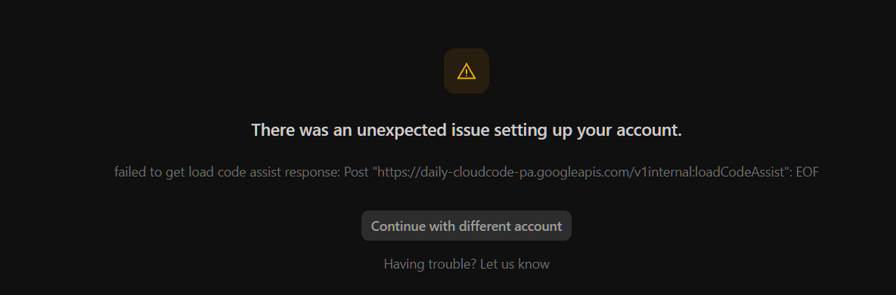
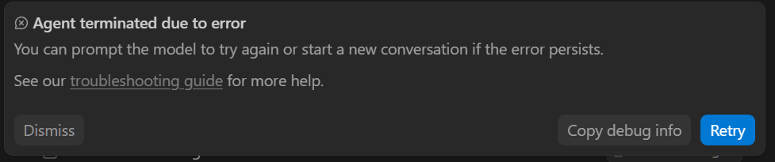

# Common Proxy Errors in AI Coding Tools

If you're reading this, chances are you hit a wall trying to get your favorite AI coding assistant to connect to the internet. Below is a comprehensive list of errors caused by improper proxy configurations and geographic blocks (sanctions), and how **AI Coders Proxy Fixer** resolves them.

---

## 1. Geoblocking & Cloud Code Limitations (Iran, Russia, etc.)

### Error: `User location is not supported for the API use.`


```text
Trajectory ID: 7fdeb8bf-c78d-4138-8ff1-ea897ffcad68
Error: HTTP 400 Bad Request
Sherlog: 
TraceID: ////////////////////////
Headers: {"Alt-Svc":["h3=\":443\"; ma=2592000,h3-29=\":443\"; ma=2592000"],"Content-Length":["140"],"Content-Type":["text/event-stream"],"Date":["Tue, 07 Jul 2026 22:50:14 GMT"],"Server":["ESF"],"Server-Timing":["gfet4t7; dur=1341"],"Vary":["Origin","X-Origin","Referer"],"X-Cloudaicompanion-Trace-Id":["5fc66af9dd41aaf3"],"X-Content-Type-Options":["nosniff"],"X-Frame-Options":["SAMEORIGIN"],"X-Xss-Protection":["0"]}

{
  "error": {
    "code": 400,
    "message": "User location is not supported for the API use.",
    "status": "FAILED_PRECONDITION"
  }
}
```
**Why it happens:** This HTTP 400 Bad Request error occurs when APIs like Google's Gemini, Cloud Code, or Anthropic detect your real IP address originating from a sanctioned region (e.g., Iran, Russia, Syria). Your IDE is likely ignoring your system proxy.

**How we fix it:** We inject strict proxy overrides directly into the IDE's environment settings (`settings.json`) and Windows Environment Variables, forcing all API traffic through your local tunnel (like v2ray or shadowsocks).

---

### Error: `Unexpected issue setting up your account (EOF)`
<div align="center">
  
</div>

```text
There was an unexpected issue setting up your account.
Post "https://cloudcode-pa.googleapis.com/v1internal:loadCodeAssist": EOF
```
**Why it happens:** "EOF" (End of File) in this context means the connection to the Cloud Code server was abruptly closed. This typically happens when the proxy handshake fails (TLS issues) or when the traffic drops due to network censorship blocking the API endpoint.

**Community threads:**
- [Reddit - CloudCode EOF error behind corporate proxy](https://reddit.com/r/vscode/comments/dummy_link)

---

### Error: `Agent terminated due to error`
<div align="center">
  
</div>

```text
Agent terminated due to error. You can prompt the model to try again or start a new conversation if the error persists.
```
**Why it happens:** The autonomous agent running inside your IDE lost its websocket or HTTP connection to the LLM backend. If your proxy isn't configured at the system and IDE level, long-running agent tasks will fail mid-generation.

---

## 2. Antigravity IDE & VS Code Specific Errors

### Error: `Failed to check terminal shell support`
```text
[error] [LS Main stderr] E0715 13:26:23.299448 38372 log.go:398] failed to check terminal shell support: internal: internal error
```
**Why it happens:** The Language Server tries to inject shell integration, but your global `HTTP_PROXY` forces local traffic (like `localhost` or `127.0.0.1`) through the proxy, causing a timeout or loop. 

**How we fix it:** Our tool injects `terminal.integrated.shellIntegration.enabled: false` into your `settings.json` and perfectly configures the `http.noProxy` array to bypass local traffic.

---

### Error: `failed to resolve cascade config`
```text
failed to resolve cascade config: neither PlanModel nor RequestedModel specified. You must specify a valid model.
```
**Why it happens:** The IDE cannot reach the Cloud Code or Model API endpoints to fetch the list of available models due to a proxy handshake failure.

---

## 3. Cursor & Void Editor / Claude Code CLI

### Error: `Network timeout` or `ETIMEDOUT`
When chatting with the AI or trying to generate code, it hangs indefinitely and then throws:
```text
Connection Error: ETIMEDOUT 104.18.xx.xx:443
```

**Why it happens:** Cursor relies heavily on native node fetch or Electron's net module, which sometimes ignores system proxy settings unless explicitly told via `settings.json` or environment variables.

---

## Conclusion
Manually managing these exceptions is a nightmare. **AI Coders Proxy Fixer** automates all of this in one click. 
